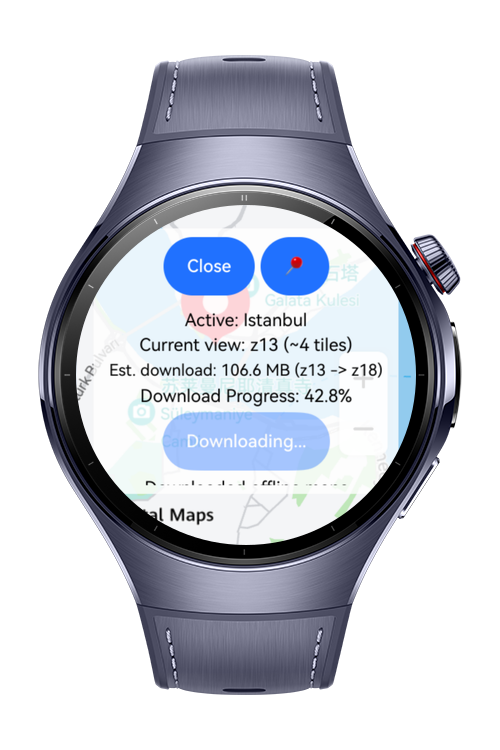
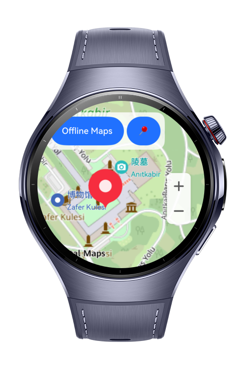
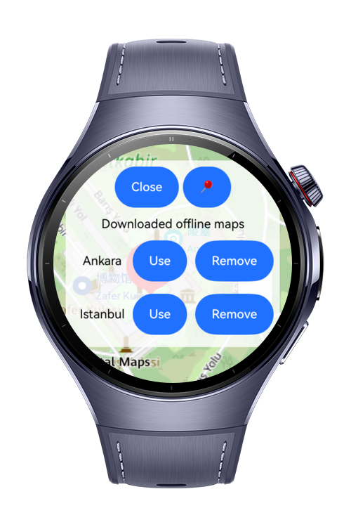
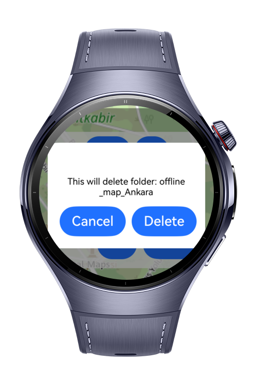

> **Note:** To access all shared projects, get information about environment setup, and view other guides, please visit [Explore-In-HMOS-Wearable Index](https://github.com/Explore-In-HMOS-Wearable/hmos-index).

# Offline Map
Offline map demo for HarmonyOS wearables: browse a map, download the current view as OpenStreetMap tiles, and render downloaded tiles offline via a tile overlay.

# Preview
<div>
  
  
  
  
</div>

# Use Cases
- Download the current visible map area for offline use.
- Switch between saved offline areas and view them without a network connection.
- Delete saved offline areas from app storage.
- Resume downloads on default-network changes (e.g., Wi‑Fi ↔ cellular) by stopping current transfers and starting new ones.

# Technology
## Stack

**Languages**: ArkTS, ArkUI  
**Frameworks**: HarmonyOS SDK 6.0.1  
**Tools**: DevEco Studio 6.0.1  
**Libraries/Kits**:
- @kit.MapKit
- @ohos.net.connection
- @ohos.net.http
- @ohos.file.fs
- @ohos.promptAction
- @ohos.geoLocationManager
- @ohos.abilityAccessCtrl
- Tile source: OpenStreetMap tile server (`https://tile.openstreetmap.org/{z}/{x}/{y}.png`)

## Required Permissions
- `ohos.permission.INTERNET`
- `ohos.permission.GET_NETWORK_INFO`
- `ohos.permission.LOCATION`
- `ohos.permission.APPROXIMATELY_LOCATION`

# Directory Structure
```
.\entry\src\main\ets
├───common
│       OfflineMapUtils.ets
│       OpenStreetMapAPI.ets
│       TileMathUtils.ets
│       TileStorageHelper.ets
├───entryability
│       EntryAbility.ets
└───pages
    │   Index.ets
    └───index
            DownloadManager.ets
            LocationManager.ets
            OfflineMapView.ets
            TileOverlayManager.ets
            Types.ets
            ViewportTracker.ets
```

# Constraints and Restrictions
## Supported Devices
- Huawei Watch 5
- DevEco Studio Simulator

## Limitations

- Users need to apply location permissions and enable location in smart watch

# LICENSE

Offline Map is distributed under the terms of the MIT License. 
See the [LICENSE](/LICENSE) for more information.